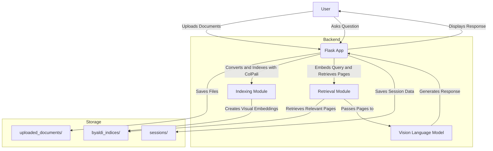

# localGPT-Vision

[](https://github.com/PromtEngineer/localGPT/stargazers)
[](https://github.com/PromtEngineer/localGPT/network/members)
[](https://github.com/PromtEngineer/localGPT/issues)
[](https://github.com/PromtEngineer/localGPT/pulls)
[](https://github.com/PromtEngineer/localGPT/blob/main/LICENSE)

localGPT-Vision is an end-to-end vision-based Retrieval-Augmented Generation (RAG) system. It allows users to upload and index documents (PDFs and images), ask questions about the content, and receive responses along with relevant document snippets. The retrieval is performed using the [ColPali](https://huggingface.co/blog/manu/colpali) model, and the retrieved pages are passed to a Vision Language Model (VLM) for generating responses. Currently, the code supports three VLMs: Qwen2-VL-7B-Instruct, Google Gemini, and OpenAI GPT-4. The project is built on top of the [Byaldi](https://github.com/AnswerDotAI/byaldi) library.

## Table of Contents
- [Features](#features)
- [Architecture](#architecture)
- [Prerequisites](#prerequisites)
- [Installation](#installation)
- [Usage](#usage)
- [Project Structure](#project-structure)
- [System Workflow](#system-workflow)
- [Contributing](#contributing)
- [License](#license)

## Features
- End-to-End Vision-Based RAG: Combines visual document retrieval with language models for comprehensive answers.
- Document Upload and Indexing: Upload PDFs and images, which are then indexed using ColPali for retrieval.
- Chat Interface: Engage in a conversational interface to ask questions about the uploaded documents.
- Session Management: Create, rename, switch between, and delete chat sessions.
- Model Selection: Choose between different Vision Language Models (Qwen2-VL-7B-Instruct, Google Gemini, OpenAI GPT-4).
- Persistent Indexes: Indexes are saved on disk and loaded upon application restart. (TODO: bug fixes needed)

## Architecture
localGPT-Vision is built as an end-to-end vision-based RAG system. T he architecture comprises two main components:

1. Visual Document Retrieval with ColPali:
   - [ColPali](https://huggingface.co/blog/manu/colpali) is a Vision Language Model designed for efficient document retrieval solely using the image representation of document pages.
   - It embeds page images directly, leveraging visual cues like layout, fonts, figures, and tables without relying on OCR or text extraction.
   - During indexing, document pages are converted into image embeddings and stored.
   - During querying, the user query is matched against these embeddings to retrieve the most relevant document pages.
   
   

2. Response Generation with Vision Language Models:
   - The retrieved document images are passed to a Vision Language Model (VLM).
   - Supported models include Qwen2-VL-7B-Instruct, Google Gemini, and OpenAI GPT-4.
   - These models generate responses by understanding both the visual and textual content of the documents.
   - NOTE: The quality of the responses is highly dependent on the VLM used and the resolution of the document images.

This architecture eliminates the need for complex text extraction pipelines and provides a more holistic understanding of documents by considering their visual elements. You don't need any chunking strategies or selection of embeddings model or retrieval strategy used in traditional RAG systems.

## Prerequisites
- Anaconda or Miniconda installed on your system
- Python 3.10 or higher
- Git (optional, for cloning the repository)

## Installation
Follow these steps to set up and run the application on your local machine.

1. Clone the Repository
   ```bash
   git clone -b localGPT-Vision --single-branch https://github.com/PromtEngineer/localGPT.git localGPT_Vision
   cd localGPT_Vision
   ```

2. Create a Conda Environment
   ```bash
   conda create -n localgpt-vision python=3.10
   conda activate localgpt-vision
   ```

3a. Install Dependencies
   ```bash
   pip install -r requirements.txt
   ```

3b. Install Transformers from HuggingFace - Dev version
   ```bash
    pip uninstall transformers
    pip install git+https://github.com/huggingface/transformers
   ```

4. Set Environment Variables
   Set your API keys for Google Gemini and OpenAI GPT-4:

   ```bash
   export GENAI_API_KEY='your_genai_api_key'
   export OPENAI_API_KEY='your_openai_api_key'
   ```

   On Windows Command Prompt:
   ```cmd
   set GENAI_API_KEY=your_genai_api_key
   set OPENAI_API_KEY=your_openai_api_key
   ```

5. Run the Application
   ```bash
   python app.py
   ```

6. Access the Application
   Open your web browser and navigate to:
   ```
   http://localhost:5000/
   ```

## Usage
### Upload and Index Documents
1. Click on "New Chat" to start a new session.
2. Under "Upload and Index Documents", click "Choose Files" and select your PDF or image files.
3. Click "Upload and Index". The documents will be indexed using ColPali and ready for querying.

### Ask Questions
1. In the "Enter your question here" textbox, type your query related to the uploaded documents.
2. Click "Send". The system will retrieve relevant document pages and generate a response using the selected Vision Language Model.

### Manage Sessions
- Rename Session: Click "Edit Name", enter a new name, and click "Save Name".
- Switch Sessions: Click on a session name in the sidebar to switch to that session.
- Delete Session: Click "Delete" next to a session to remove it permanently.

### Settings
1. Click on "Settings" in the navigation bar.
2. Select the desired language model and image dimensions.
3. Click "Save Settings".

## Project Structure
```
localGPT-Vision/
├── app.py
├── logger.py
├── models/
│   ├── indexer.py
│   ├── retriever.py
│   ├── responder.py
│   ├── model_loader.py
│   └── converters.py
├── sessions/
├── templates/
│   ├── base.html
│   ├── chat.html
│   ├── settings.html
│   └── index.html
├── static/
│   ├── css/
│   │   └── style.css
│   ├── js/
│   │   └── script.js
│   └── images/
├── uploaded_documents/
├── byaldi_indices/
├── requirements.txt
├── .gitignore
└── README.md
```

- `app.py`: Main Flask application.
- `logger.py`: Configures application logging.
- `models/`: Contains modules for indexing, retrieving, and responding.
- `templates/`: HTML templates for rendering views.
- `static/`: Static files like CSS and JavaScript.
- `sessions/`: Stores session data.
- `uploaded_documents/`: Stores uploaded documents.
- `.byaldi/`: Stores the indexes created by Byaldi.
- `requirements.txt`: Python dependencies.
- `.gitignore`: Files and directories to be ignored by Git.
- `README.md`: Project documentation.

## System Workflow
1. User Interaction: The user interacts with the web interface to upload documents and ask questions.
2. Document Indexing with ColPali:
   - Uploaded documents are converted to PDFs if necessary.
   - Documents are indexed using ColPali, which creates embeddings based on the visual content of the document pages.
   - The indexes are stored in the byaldi_indices/ directory.
3. Session Management:
   - Each chat session has a unique ID and stores its own index and chat history.
   - Sessions are saved on disk and loaded upon application restart.
4. Query Processing:
   - User queries are sent to the backend.
   - The query is embedded and matched against the visual embeddings of document pages to retrieve relevant pages.
5. Response Generation with Vision Language Models:
   - The retrieved document images and the user query are passed to the selected Vision Language Model (Qwen, Gemini, or GPT-4).
   - The VLM generates a response by understanding both the visual and textual content of the documents.
6. Display Results:
   - The response and relevant document snippets are displayed in the chat interface.



## Contributing
Contributions are welcome! Please follow these steps:

1. Fork the repository.
2. Create a new branch for your feature: `git checkout -b feature-name`.
3. Commit your changes: `git commit -am 'Add new feature'`.
4. Push to the branch: `git push origin feature-name`.
5. Submit a pull request.

## Star History

[](https://star-history.com/#PromtEngineer/localGPT&Date)
